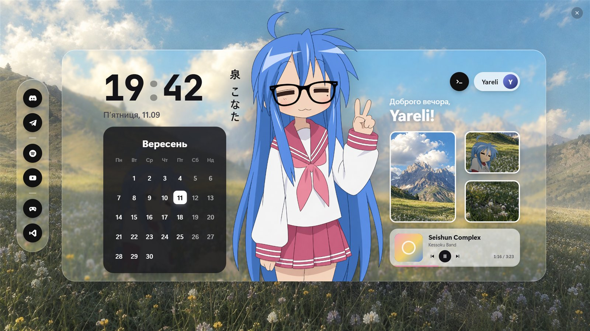

# Glass Dash

Скляний аніме-дашборд для [Wallpaper Engine](https://store.steampowered.com/app/431960/): годинник, календар, музика, персонаж, що виходить за скло, і бічна панель, яка працює як док.



[English below](#english)

## Що вміє

- **Годинник і календар** українською або англійською, привітання за часом доби з вашим імʼям.
- **Музика** з будь-якого плеєра, який бачить Windows (Spotify, браузер…): назва, виконавець, обкладинка, прогрес, кнопки ⏮ ⏯ ⏭.
- **Матове скло**, персонаж, галерея, фон, акцентний колір — усе міняється в налаштуваннях шпалери.
- **Бічна панель** (Discord, Telegram, Spotify, YouTube, Steam, VS Code) працює як док: відкриває програму, виводить її наперед, а якщо вона вже була попереду — згортає.
- **Аватар**: будь-яка картинка або фото вашого акаунта Windows.

## Встановлення

1. Підпишіться на **Glass Dash** у Майстерні Steam — або скопіюйте теку [`wallpaper`](wallpaper) у `wallpaper_engine\projects\myprojects\`.
2. Щоб працювали кнопки, встановіть **Glass Dash Helper** (нижче). Без нього працює все, крім кнопок.

## Glass Dash Helper

Wallpaper Engine навмисно не дає HTML-шпалерам запускати програми. Тому кнопки просять про це крихітну фонову програму: ~20 КБ, без вікна, близько 20 МБ памʼяті.

1. Завантажте `glass-dash-helper.zip` з [Releases](https://github.com/Yareli0i/glass-dash/releases/latest) і розпакуйте.
2. Двічі клацніть `install.cmd` — помічник скопіюється в `%LOCALAPPDATA%\GlassDash`, запуститься й стартуватиме разом з Windows.
   Windows може попередити про «невідомого видавця» («Докладніше» → «Однаково запустити»): програма не має цифрового підпису. Її код відкритий — [`helper/helper.cs`](helper/helper.cs), зібрати самостійно можна через [`helper/build.cmd`](helper/build.cmd).
3. Видалення — `uninstall.cmd` з того самого архіву.

Без архіву: покладіть `glass-dash-helper.exe` у будь-яку теку й виконайте `glass-dash-helper.exe --install` (прибрати — `--uninstall`).

**Безпека.** Помічник слухає лише `127.0.0.1:47831`, тож з інших компʼютерів він недоступний. Відповідає тільки шпалері: сайти в браузері отримують відмову. Виконує лише дії з `glass-dash-helper.ini` і три медіаклавіші. Фото акаунта віддає так, що сторінки в інтернеті не можуть його прочитати.

**Налаштування кнопок** — `glass-dash-helper.ini` поруч з exe (створюється при першому запуску, зміни підхоплюються одразу):

```ini
; id = що відкрити | програми, чиї вікна кнопка згортає/розгортає
discord  = discord://          | Discord, DiscordPTB, DiscordCanary, Vesktop
telegram = exe-of:tg           | Telegram
youtube  = https://www.youtube.com/
```

Відкрити можна протокол (`spotify:`), сайт, шлях до програми або `exe-of:<протокол>` — програму, зареєстровану для цього протоколу.

## Свій персонаж

Потрібен PNG з прозорим фоном; розмір і висоту персонажа можна підкрутити в налаштуваннях шпалери. Щоб вирізати персонажа з картинки, є [`tools/cutout.py`](tools/cutout.py) (rembg з моделлю `isnet-anime`):

```
pip install -r tools/requirements.txt
python tools/cutout.py picture.jpg character.png
```

## Подяки та ліцензії

- Код — [MIT](LICENSE).
- Шрифт годинника — [JetBrains Mono](https://github.com/JetBrains/JetBrainsMono) у збірці [Nerd Fonts](https://www.nerdfonts.com), SIL OFL 1.1 ([`OFL.txt`](wallpaper/assets/fonts/OFL.txt)).
- Коната Ідзумі й «Lucky Star» © Kagami Yoshimizu / Kadokawa. Це фанатська робота, не повʼязана з правовласниками; персонаж і фон доопрацьовані за допомогою ChatGPT.
- Discord, Telegram, Spotify, YouTube, Steam і Visual Studio Code — торгові марки їхніх власників; іконки на панелі — спрощені малюнки.

---

## English

A glassy anime dashboard for Wallpaper Engine: clock, calendar, now-playing music, a character that steps out of the glass, and a side dock.

- **Clock & calendar** in Ukrainian or English, with a time-of-day greeting.
- **Music** from any player Windows knows about (Spotify, browsers…) with ⏮ ⏯ ⏭.
- **Frosted glass**, character, gallery, background and accent colour are all wallpaper properties.
- **Side dock** (Discord, Telegram, Spotify, YouTube, Steam, VS Code): opens an app, brings it to the front, or minimizes it if it already was in front.
- **Avatar**: any picture, or your Windows account picture.

**Install:** subscribe on the Steam Workshop (or copy [`wallpaper`](wallpaper) into `wallpaper_engine\projects\myprojects\`). For the buttons, get `glass-dash-helper.zip` from [Releases](https://github.com/Yareli0i/glass-dash/releases/latest), unpack it and double-click `install.cmd` (`uninstall.cmd` removes it; or run `glass-dash-helper.exe --install` / `--uninstall` from any folder). Wallpaper Engine does not let HTML wallpapers launch programs, which is why this tiny (~20 KB, windowless) helper exists. It listens on `127.0.0.1` only, answers only the wallpaper, runs nothing but the entries in `glass-dash-helper.ini` plus three media keys, and serves the account picture in a way web pages cannot read. Windows may warn about an unknown publisher because the exe is unsigned; the source is in [`helper/`](helper) and builds with [`helper/build.cmd`](helper/build.cmd).

**Credits:** code under [MIT](LICENSE); clock font JetBrains Mono (Nerd Fonts build), SIL OFL 1.1; Konata Izumi and Lucky Star © Kagami Yoshimizu / Kadokawa — unofficial fan work, character and background edited with ChatGPT; app names are trademarks of their owners.
