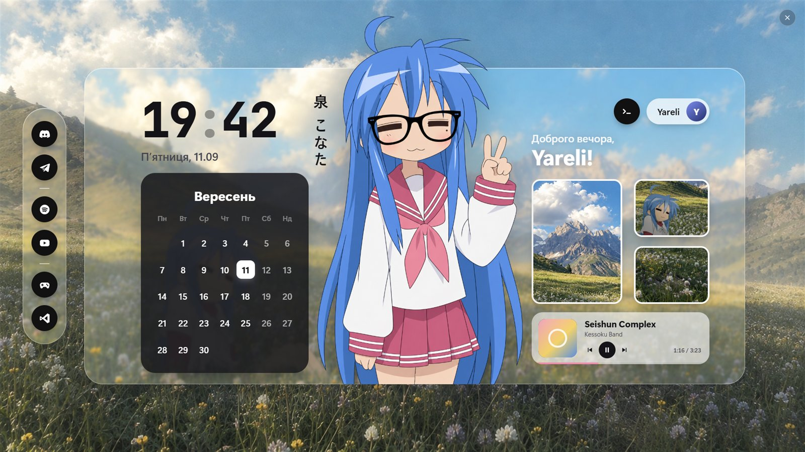

# Glass Dash

A frosted-glass desktop dashboard for [Wallpaper Engine](https://store.steampowered.com/app/431960/): clock, calendar, weather, now playing, a character stepping out of the glass, and a side dock for your apps.



[Українською нижче](#українською)

## What it does

- **Clock, date and calendar**, and a greeting with your name that follows the time of day.
- **Now playing** from any player Windows sees (Spotify, a browser…): title, artist, cover, progress, ⏮ ⏯ ⏭. The accent colour follows the cover.
- **Weather** for your city with the next few hours — instead of the player or next to it.
- **Side dock** (Discord, Telegram, Spotify, YouTube, Steam, VS Code): a button opens the app, brings it to the front, or minimizes it if it was already in front. Each one lights up in the app's own colour.
- **Terminal** and **Documents** buttons next to your name.
- **Frosted glass**, background (built-in, your own picture or a `.webm`), character, gallery, avatar and accent colour are all wallpaper settings.
- English by default, Ukrainian as an option — both for the dashboard and for its settings.

## Install

1. Subscribe to [**Glass Dash** on the Steam Workshop](https://steamcommunity.com/sharedfiles/filedetails/?id=3799717997) — or copy the [`wallpaper`](wallpaper) folder into `wallpaper_engine\projects\myprojects\`.
2. For the buttons, install **Glass Dash Helper** (below). Everything else works without it.

Don't need the buttons? Turn **Buttons** off in the wallpaper settings: the dock, the terminal and the music controls disappear, and nothing asks for the helper.

## Glass Dash Helper

Wallpaper Engine deliberately does not let wallpapers open programs or control music. So the buttons ask a tiny background program to do it: about 20 KB, no window, around 20 MB of memory.

1. Download [`glass-dash-helper.zip`](https://github.com/Yareli0i/glass-dash/releases/latest/download/glass-dash-helper.zip) and unpack it.
2. Double-click `install.cmd` — the helper is copied to `%LOCALAPPDATA%\GlassDash`, starts now and with Windows. The buttons work right away.
   Windows may warn about an "unknown publisher" ("More info" → "Run anyway"): the program is not signed. Its source is open — [`helper/helper.cs`](helper/helper.cs) — and [`helper/build.cmd`](helper/build.cmd) builds it with the compiler that ships with Windows.
3. To remove it, run `uninstall.cmd` from the same archive.

Without the archive: put `glass-dash-helper.exe` in any folder and run `glass-dash-helper.exe --install` (`--uninstall` removes it).

**Safety.** The helper listens on `127.0.0.1:47831` only, so other computers cannot reach it. It answers only the wallpaper: websites in a browser are refused. It runs only what is listed in `glass-dash-helper.ini` plus three media keys. The account picture is served in a way web pages cannot read.

**What the buttons do** is set in `glass-dash-helper.ini` next to the exe (written at first start; changes are picked up at once):

```ini
; id = what to open | programs whose windows the button minimizes / restores
discord   = discord://          | Discord, DiscordPTB, DiscordCanary, Vesktop
telegram  = exe-of:tg           | Telegram
youtube   = https://www.youtube.com/
documents = shell:Personal
```

A target can be a protocol (`spotify:`), a website, a path to a program, or `exe-of:<protocol>` — the program registered for that protocol. Buttons added in a newer version work even if your file is older; a line of your own always wins.

## Privacy

The only thing that leaves your PC is the weather request: the city you typed goes to [open-meteo.com](https://open-meteo.com). No city, no request.

## Your own character

You need a PNG with a transparent background; its size and height are wallpaper settings. To cut a character out of a picture there is [`tools/cutout.py`](tools/cutout.py) (rembg with the `isnet-anime` model):

```
pip install -r tools/requirements.txt
python tools/cutout.py picture.jpg character.png
```

## Credits and licences

- Code — [MIT](LICENSE).
- Clock font — [JetBrains Mono](https://github.com/JetBrains/JetBrainsMono) in the [Nerd Fonts](https://www.nerdfonts.com) build, SIL OFL 1.1 ([`OFL.txt`](wallpaper/assets/fonts/OFL.txt)).
- Weather data — [Open-Meteo](https://open-meteo.com), CC BY 4.0.
- Konata Izumi and Lucky Star © Kagami Yoshimizu / Kadokawa. This is an unofficial fan work, not affiliated with the rights holders.
- Discord, Telegram, Spotify, YouTube, Steam and Visual Studio Code are trademarks of their owners; the dock icons are simplified drawings.

---

## Українською

Скляний дашборд для Wallpaper Engine: годинник, календар, погода, музика, персонаж, що виходить за скло, і бічна панель-док.

- **Годинник, дата й календар**, привітання за часом доби з вашим імʼям.
- **Музика** з будь-якого плеєра, який бачить Windows (Spotify, браузер…): назва, виконавець, обкладинка, прогрес, ⏮ ⏯ ⏭. Акцентний колір підлаштовується під обкладинку.
- **Погода** для вашого міста на найближчі години — замість плеєра або поруч із ним.
- **Бічна панель** (Discord, Telegram, Spotify, YouTube, Steam, VS Code): відкриває програму, виводить її наперед, а якщо вона вже була попереду — згортає. Кожна кнопка світиться кольором своєї програми.
- Кнопки **термінала** й **«Документів»** поруч з імʼям.
- **Матове скло**, фон, персонаж, галерея, аватар, акцентний колір — у налаштуваннях шпалери.
- Типово англійською; українська вмикається в налаштуваннях — і для дашборда, і для самих налаштувань.

**Встановлення:** підпишіться в [Майстерні Steam](https://steamcommunity.com/sharedfiles/filedetails/?id=3799717997) (або скопіюйте теку [`wallpaper`](wallpaper) у `wallpaper_engine\projects\myprojects\`). Щоб працювали кнопки, завантажте [`glass-dash-helper.zip`](https://github.com/Yareli0i/glass-dash/releases/latest/download/glass-dash-helper.zip), розпакуйте й двічі клацніть `install.cmd` (`uninstall.cmd` прибирає; або `glass-dash-helper.exe --install` / `--uninstall` з будь-якої теки). Кнопки не потрібні — вимкніть **«Кнопки»** в налаштуваннях шпалери.

Wallpaper Engine навмисно не дає шпалерам запускати програми, тому й існує цей помічник: близько 20 КБ, без вікна. Він слухає лише `127.0.0.1`, відповідає тільки шпалері, виконує лише дії з `glass-dash-helper.ini` і три медіаклавіші, а фото акаунта віддає так, що сторінки в інтернеті не можуть його прочитати. Windows може попередити про невідомого видавця, бо в програми немає цифрового підпису; код — у [`helper/`](helper), збирається через [`helper/build.cmd`](helper/build.cmd).

За межі ПК іде лише запит погоди: назва вашого міста — на open-meteo.com.

**Подяки:** код під [MIT](LICENSE); шрифт годинника — JetBrains Mono (збірка Nerd Fonts), SIL OFL 1.1; погода — Open-Meteo; Коната Ідзумі й «Lucky Star» © Kagami Yoshimizu / Kadokawa — неофіційна фанатська робота; назви програм — торгові марки їхніх власників.
